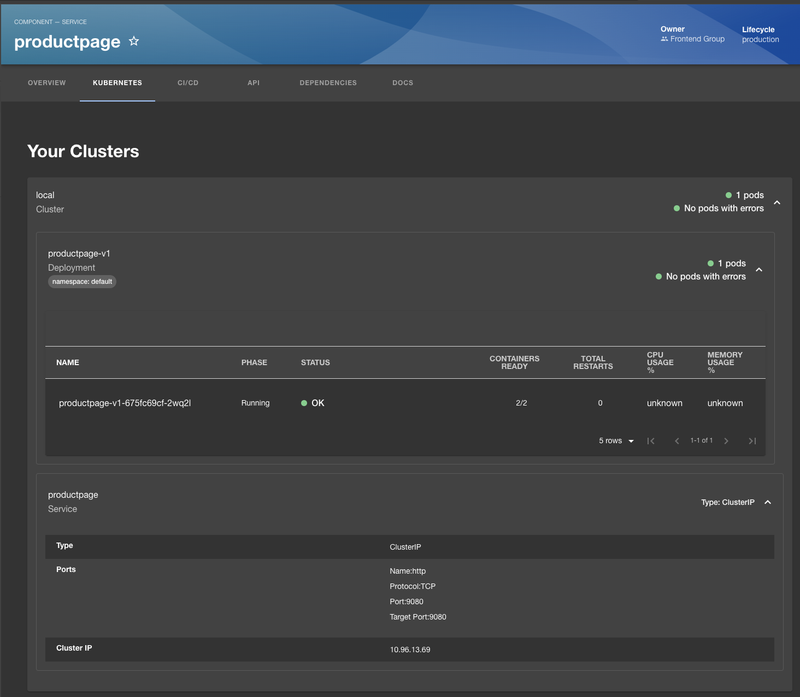

# Bookstageinfo

This is repo used to showcase Backstage withe the Bookinfo application (hence book-stage-info).


The source for the bookinfo service is from the [Istio repo](https://github.com/istio/istio/).

## Backstage setup

The Backstage app is in the `backstage` folder. Before you run the app, make sure you set up the database and configure environment variables.

### 1. Database setup

Backstage is configured to use the local postgres database. You can run the database using docker:

```shell
docker run --name some-postgres -p 5432:5432 -e POSTGRES_PASSWORD=mysecretpassword -d postgres
```

If you want to use a different database, you can change the database configuration in the `backstage/app-config.yaml` file.

### 2. Environment variables

Before you run the app, you need to set the environment variables for Github integration (`GITHUB_TOKEN`) and auth (`GITHUB_CLIENT_ID` and `GITHUB_CLIENT_SECRET`). 

```shell
export GITHUB_TOKEN=your-github-token
export GITHUB_CLIENT_ID=your-github-client-id
export GITHUB_CLIENT_SECRET=your-github
```

Check the `app-config.yaml` for links to the documentation on how to get these values.

### 3. Run the app

To run the app, you can use the following commands:

```shell
cd backstage
yarn dev
```

Before you run the app for the first time, make sure you installed the dependencies (`yarn install`).

## Setting up Kubernetes

The configuration (`app-config.yaml`) assumes you have a local Kubernetes cluster running (i.e. `kubectl proxy`) that Backstage app can access. Additionally, it's assumed you have deployed the [Bookinfo application to the cluster](https://raw.githubusercontent.com/istio/istio/release-1.20/samples/bookinfo/platform/kube/bookinfo.yaml). Alternatively, you can individually deploy services using the manfiests in the `/deploy` folder.


Once you have the Kubernetes cluster setup, Bookinfo deployed and the proxy running, you'll see a "Kubernetes" tab on the components page:

